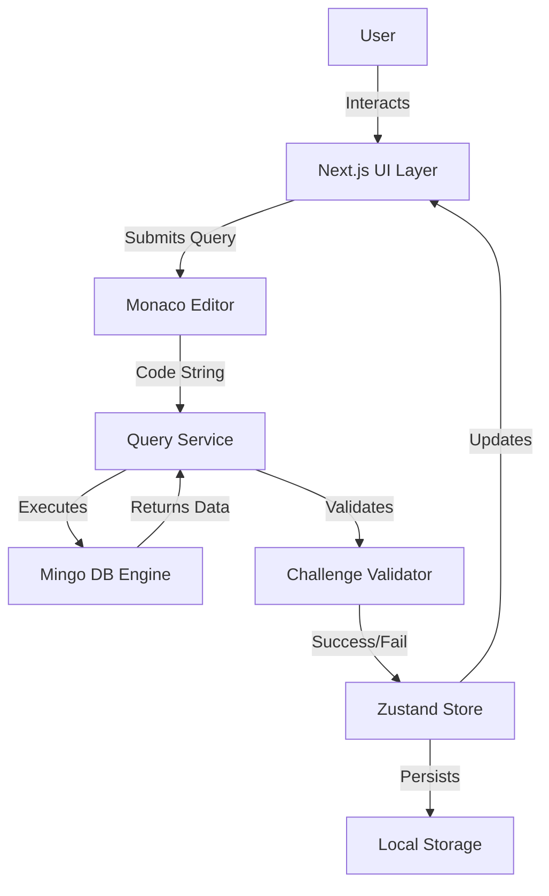

# Mongo Playground 🍃


> **Master MongoDB with Gamified Learning.**

**Mongo Playground** is an interactive, gamified platform designed to help developers master MongoDB. It features a live in-memory database engine, instant feedback, daily streaks, and a leveled progression system. Whether you're a beginner learning basic queries or an expert optimizing aggregations, Mongo Playground provides a safe, fun, and competitive environment to level up your skills.

## 🚀 Key Features

*   **Interactive Shell**: Execute MongoDB queries directly in your browser against a live `mingo` in-memory database.
*   **Instant Feedback**: Get real-time validation for your solutions.
*   **Gamification**: Earn XP, maintain daily streaks, and climb the leaderboard.
*   **Progressive Difficulty**: Work through clear levels ranging from Basic CRUD to Complex Aggregations.
*   **Beautiful UI**: A modern, responsive interface built with Next.js and Tailwind CSS.
*   **Dark/Light Mode**: Fully customizable appearance with various themes.

---

## 🛠️ Technology Stack

This project is built using a modern, robust web stack:

*   **Framework**: [Next.js 16](https://nextjs.org/) (App Router)
*   **Language**: [TypeScript](https://www.typescriptlang.org/)
*   **Styling**: [Tailwind CSS 4](https://tailwindcss.com/)
*   **Database Engine**: [Mingo](https://github.com/kofrasa/mingo) (MongoDB query engine for JS)
*   **State Management**: [Zustand](https://github.com/pmndrs/zustand)
*   **Icons**: [Lucide React](https://lucide.dev/)
*   **Animations**: [Framer Motion](https://www.framer.com/motion/)

---

## 🧩 Architecture & Flow

The application follows a client-side heavy architecture where the database engine runs entirely in the browser for zero-latency interactions.



### Folder Structure

```
mongo_practices/
├── app/                  # Next.js App Router pages & layouts
│   ├── levels/           # Level selection & game logic
│   ├── playground/       # Free-form playground
│   └── page.tsx          # Landing page
├── components/           # Reusable UI components
│   ├── ui/               # Radix UI primitives
│   ├── editor/           # Code editor components
│   └── ...
├── data/                 # Static game data (challenges, levels)
├── lib/                  # Utility functions
├── services/             # Core logic (DB engine, validation)
└── public/               # Static assets
```

---

## 🏁 Getting Started

Follow these steps to set up the project locally.

### Prerequisites

*   **Node.js**: v18 or higher
*   **npm** or **yarn** or **pnpm**

### Installation

1.  **Clone the repository**:
    ```bash
    git clone https://github.com/akshaykumar33/mongo_playground.git
    cd mongo_playground
    ```

2.  **Install dependencies**:
    ```bash
    npm install
    ```

3.  **Run the development server**:
    ```bash
    npm run dev
    ```

4.  **Open in Browser**:
    Visit [http://localhost:3000](http://localhost:3000) to see the application running.

---

## 🤝 Contributing

Capabilities exist for adding new levels, fixing bugs, or improving the documentation.

Please read our [Contributing Guide](CONTRIBUTING.md) for details on our code of conduct and the process for submitting pull requests.

## 📜 License

This project is licensed under the MIT License - see the [LICENSE](LICENSE) file for details.

---

<p align="center">
  Built with ❤️ by <a href="https://github.com/akshaykumar33">Akshaykumar</a>
</p>
